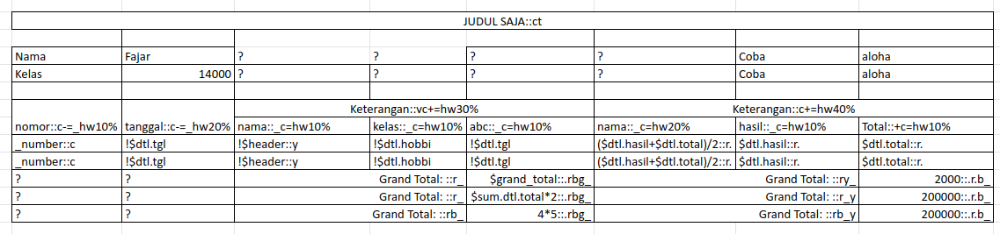

##  HTML-PDF-EXCEL

Thanks to
[TCPDF](https://github.com/tecnickcom/TCPDF) and [PHPSpreadsheet](https://github.com/PHPOffice/PhpSpreadsheet). This library is a helper to generate html, pdf, and excel from excel-based template and array data.



### Installation
```
composer require starlight93/html-pdf-excel
```

### Usage

```php

//  your array of data, see: /testing/1data.json
$data = [
    'key'=>'value',
    'detail' => [
        [
            'key_detail1'   => 'value1',
            'amount'    => 2000
        ],[
            'key_detail1'   => 'value2',
            'amount'    => 1000
        ]
    ]
];

//  example: function to get string from a text file
public function getFromFile( $path ){
    $file = fopen( $path, "r" );
    $dt =  fread( $file ,filesize($path) ) ;
    fclose($file);
    return $dt;
}

//  your template string, see: /testing/1template.txt
$template = getFromFile(  "your text file path" );

$renderer = new \Starlight93\HtmlPdfExcel\Renderer;
//  if you want to try with /testing data dan template just pass true to Renderer Construct
// $renderer = new \Starlight93\HtmlPdfExcel\Renderer( true );
// with parameter true will take the data and template from /testing dir, so you can focus on config only

//  ======================= example rendering PDF start
$renderer->renderPDF(data: $data, template: $template, config: [
    'title' =>'testing',
    'break' => true,
    'left'  => 10,
    'top'   => 10,
    'right' => 12,
    'orientation'   =>'L',
    'size'  => [210, 297], // can be A4, F4, etc
    'fontSize'  => 10,
    'callback' => function( $pdf ){
        //  see tcpdf documentation for any available property and function
    },
    'header_callback' => function( $hd ){
        //  see tcpdf documentation for any available property and function
    },

    'footer_callback' => function( $ft ){
        //  see tcpdf documentation for any available property and function
    },
]);
//  ======================= end


//  ======================= example rendering XLS start
$renderer->renderXls(data: $data, template: $template, config: [
    'title' => 'testing',
    'break' => true, // to separate into 
    'orientation'   =>'L',
    'size'  => 9, // see https://github.com/PHPOffice/PhpSpreadsheet/blob/master/src/PhpSpreadsheet/Worksheet/PageSetup.php
    'fontSize'  => 10
]);
//  ======================= end

//  ======================= example rendering XLS start
$renderer->renderHtml(data: $data, template: $template, config: [
    'title' =>'testing',
    // 'orientation'   =>'L',
    // 'size'  => 'A4',
    'fontSize'  => 10
]);
//  ======================= end

```
### Basic Syntax
| Code | Description |
| --- | --- |
|    v | text vertical    |
|    t | text with no border  |
|    r | align content to right   |
|    l | align content to left    |
|    c | align content to center  |
|    b | **bold**    |
|    h | header or column head  |
|    + | border all sides  |
|    [ | border left side |
|    ] | border right side    |
|    - | border top side  |
|    _ | border bottom side   |
|    = | border doubled   |
|    . | number separator formatting, Example result: from 1000000 becomes 1.000.000   |
|    w{number}% | width {number} %. Example: w25% will set the column width to 25 % of table width   |
|    u | underline   |
|    i | *italic*  |
|    g |  `gray background` |
|    y |  `yellow background`  |


### Inside Looping Syntax

| Code | Description |
| --- | --- |
|    $dataIndex | key data index  |
|    $detail.dataIndex | data index di detail    |
|    ? | space or empty cell  |
|    ! | grouping column and take the first cell value    |
|    _number | autonumberer starts from 1    |
|    ${looped_array_key}.{single_array_key} | Set value given from key  |


### Additional Features

You can also use any mathematic formula to get dynamic value as the image above such as summary or etc.